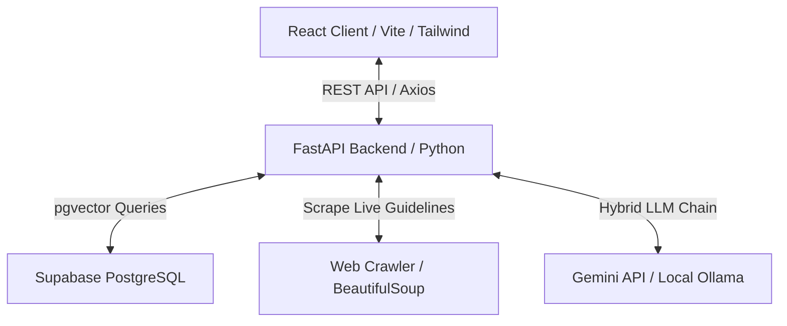

# MedSync AI

**Autonomous Medical Knowledge Drift Detection & Alignment Platform**

MedSync AI is an intelligent medical curriculum auditor and study portal developed as a semester project. It automatically cross-references medical study notes against live clinical guidelines online, detecting discrepancies, outdated dosages, and altered protocols using a hybrid AI fallback chain (Google Gemini & Local Ollama) and pgvector semantic search.

---

## 📖 Key Documentation Quick-Links

To help review the project structure and run live demonstrations, the following detailed guides are available:

*   **[User Manual / Setup Guide](file:///home/ammar-anas/Ammar/Dev/Projects/itu-medsync-ai/documents/user_manual.md)**: Step-by-step instructions for database migrations, local Ollama configuration, environment variable files, and starting the client/server servers.

---

## ✨ Features & Capabilities

### 🩺 For Students (Study Portal)
*   **Drift-Aware Note Browsing**: Browse curriculum notes categorized by subject. Outdated notes are visually flagged with status indicators (e.g., *Requires Attention*).
*   **Document Viewer & PDF Embeds**: Read documents alongside AI-generated summaries, semantic chunks, and embedded source PDF files.
*   **Local Bookmarking**: Bookmark study notes for easy offline reference using zero-auth browser storage.

### ⚙️ For Administrators (Dashboard)
*   **Document Management**: Upload notes, assign subject categories, update metadata, and associate documents with live online guidelines (clinical reference links).
*   **Hot-Swapping PDFs**: Upload updated revisions of study notes without breaking original database links, category mapping, or summary metadata.
*   **Drift Detection Engine**: Execute clinical drift audits comparing notes chunk-by-chunk with scraped reference websites.
*   **Audit Notification Center**: Receive instant alerts detailing the specific paragraphs and clinical contradictions discovered.

---

## 🏗️ Architecture & Technology Stack

MedSync AI adheres to a strict, modular **Client-Server Architecture**:



### 💻 Frontend
*   **Framework**: React (Vite-powered Single Page Application)
*   **Styling**: Tailwind CSS
*   **State & Networking**: Clean Axios instance structure utilizing base interceptors, maintaining clear separation of UI components from communication logic.

### ⚙️ Backend
*   **Framework**: FastAPI (Async python web application framework)
*   **Database Integration**: Supabase (PostgreSQL with `pgvector` enabled for semantic chunk retrieval)
*   **AI Engine**: Hybrid LLM execution chain:
    *   **Primary**: Google Gemini (`gemini-1.5-flash-lite`)
    *   **Secondary Fallback**: Local Ollama (`llama3.2:3b`) running `nomic-embed-text` for offline zero-latency embedding.

---

## 📂 Project Repository Layout

```
.
├── backend/                  # FastAPI Application Source Code
│   ├── main.py               # API Gateway & Route Controllers
│   ├── db_service.py         # Database Operations & Vector Queries
│   ├── ai_service.py         # Gemini / Ollama API Integration & Chains
│   ├── ai_scanner.py         # Drift Detection Algorithms & Web Scraping
│   ├── auth_service.py       # JWT & Admin Authorization Logic
│   └── requirements.txt      # Python Dependencies
├── frontend/                 # React Application Source Code
│   ├── src/
│   │   ├── api.js            # Central API Service Layer (Axios)
│   │   ├── components/       # Shared UI Components
│   │   └── pages/            # Admin & Student Portal Pages
│   └── package.json          # Node Dependencies
├── documents/                # Academic & Presentation Assets
│   ├── USER_MANUAL.md        # Technical Setup Guide
│   └── PRESENTATION_GUIDE.md # Viva Walkthrough Guide
└── README.md                 # Main Documentation Landing Page
```

---

## ⚡ Quick Start

1.  **Configure Models**: Pull models to your local Ollama setup:
    ```bash
    ollama pull nomic-embed-text
    ollama pull llama3.2:3b
    ```
2.  **Start Database**: Launch a PostgreSQL database with pgvector, and execute schema migrations (schema details located in user manual).
3.  **Start Backend**: Create `.env` inside `backend/`, install packages, and start FastAPI:
    ```bash
    cd backend
    pip install -r requirements.txt
    uvicorn main:app --reload
    ```
4.  **Start Frontend**: Install Node packages and start Vite:
    ```bash
    cd frontend
    npm install
    npm run dev
    ```

For full environment configurations, schema details, and credentials, view the **[User Manual](file:///home/ammar-anas/Ammar/Dev/Projects/itu-medsync-ai/documents/user_manual.md)**.